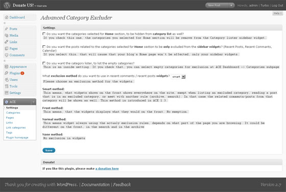
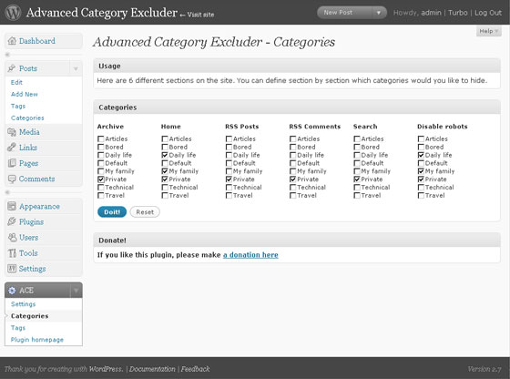

# Advanced Category Excluder

**Advanced Category Excluder** is a WordPress plugin for advanced control over category-based content visibility.

Control where selected categories appear across your WordPress site, including posts, feeds, searches, pages, and widgets.

## Features

- Category exclusion
- Post and page filtering
- Feed filtering
- Search filtering
- Category and archive control
- Custom WordPress widgets
- Localization support

## Version

**1.4.6**

Maintained by **ArchitectOfRuin**  
https://oddstyle.ru/

## PHP Compatibility

The current working installation runs on **PHP 7.4.33**.

Tested with:

- PHP 7.4

- WordPress 6.8

- Advanced Category Excluder 1.4.6

GitHub Actions automatically checks the PHP syntax using **PHP 7.4**.

> Functional compatibility should be verified in the target WordPress environment.

## Installation

Download the [latest release](https://github.com/ArchitectOfRuin/advanced-category-excluder/releases/latest).

Copy the plugin into:

`wp-content/plugins/advanced-category-excluder/`

Then activate **Advanced Category Excluder** from **WordPress → Plugins**.

## Screenshots

### Administration

### Category Settings

## Development

This repository contains a maintained fork of Advanced Category Excluder based on a currently working installation.

The goal is to preserve the existing plugin functionality while maintaining the project and documenting changes.

## Changelog

See [CHANGELOG.md](CHANGELOG.md).

## Credits

**Advanced Category Excluder**  
Maintained by **ArchitectOfRuin**

Website: [oddstyle.ru](https://oddstyle.ru/)

## License

This repository retains the licensing terms applicable to the original Advanced Category Excluder project.
